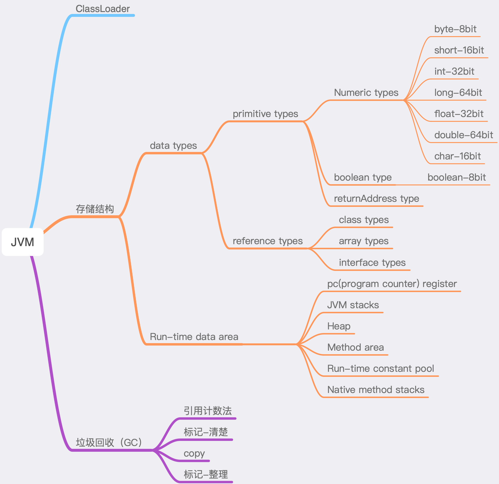

# 1 classLoader

类的加载分为三个步骤：加载（loading），链接（link），初始化（initialize）。
链接分为三个步骤：校验，准备，解析。
准备：给类的静态变量分配存储空间(4)。比如static int a；给其中的a赋予初值为0，但是这里不会给final修饰的静态变量赋予初值，
因为被final修饰的静态变量在编译期间就已经被赋予初值了，例如下面的代码Teacher1中在准备阶段之后，name 的值将是 Tony，而不是 null。
final static String name="Tony";(6)。

初始化(initialize)：
到了初始化阶段，用户定义的 Java 程序代码才真正开始执行。在这个阶段，JVM 会根据语句执行顺序对类对象进行初始化，一般来说当 JVM 遇到下面 5 种情况的时候会触发初始化：

a.遇到 new、getstatic、putstatic、invokestatic 这四条字节码指令时，如果类没有进行过初始化，则需要先触发其初始化。生成这4条指令的最常见的Java代码场景是：使用new关键字实例化对象的时候、读取或设置一个类的静态字段（被final修饰、已在编译器把结果放入常量池的静态字段除外）的时候，以及调用一个类的静态方法的时候。
b.使用 java.lang.reflect 包的方法对类进行反射调用的时候，如果类没有进行过初始化，则需要先触发其初始化。
c.当初始化一个类的时候，如果发现其父类还没有进行过初始化，则需要先触发其父类的初始化。
d.当虚拟机启动时，用户需要指定一个要执行的主类（包含main()方法的那个类），虚拟机会先初始化这个主类。
f.当使用 JDK1.7 动态语言支持时，如果一个 java.lang.invoke.MethodHandle实例最后的解析结果 REF_getstatic,REF_putstatic,REF_invokeStatic 的方法句柄，并且这个方法句柄所对应的类没有进行初始化，则需要先触发其初始化。
```
class School{
    static {
        System.out.println("School static code block");
    }
}
class Teacher extends  School{
    static {
        System.out.println("Teacher static code block");
    }
    public static String name="Tony";

    public Teacher() {
        System.out.println("I'm teacher");
    }
}
class Student extends Teacher{
    static {
        System.out.println("Student static code block");
    }

    public Student() {
        System.out.println("I'm student");
    }
}
public class InitializationDemo {
    public static void main(String[] args){
//        System.out.println("Teacher's name:"+Student.name);
        Student student=new Student();
        System.out.println("Teacher's name:"+student.name);
    }
}
//out:School static code block
//Teacher static code block
//Student static code block
//I'm teacher
//I'm student
//Teacher's name:Tony
```
以上代码说明，先加载父类，再加载子类。
```
public class Teacher1 {
    public static void main(String[] args){
        staticFunction();
    }

    private static void staticFunction() {
        System.out.println("teacher static method");
    }

    static Teacher1 teacher1=new Teacher1();

    {
        System.out.println("teacher common code block");
    }

    int age=24;
    final static String name="Tony";
    static String sex="boy";
    public Teacher1() {
        System.out.println("teacher constructor");
        System.out.println("age="+age+",name="+name+",sex="+sex);
    }
    static {
        System.out.println("teacher static code block");
    }

}
//out:teacher common code block
//teacher constructor
//age=24,name=Tony,sex=null
//teacher static code block
//teacher static method
```
这个例子中，main 主方法所在类有许多代码，这个点我们需要关注到。
a.当 JVM 在准备阶段的时候，便会为类变量分配内存和进行初始化。此时，我们的 teacher1 实例变量被初始化为 null，sex 变量被初始化为 null。
b.当进入初始化阶段后，因为 Teacher() 方法是程序的入口，根据我们上面说到的类初始化的五种情况的第四种：当虚拟机启动时，用户需要指定一个要执行的主类（包含main()方法的那个类），虚拟机会先初始化这个主类。JVM 会对 Teacher1 类进行初始化。
c.JVM 对 Teacher 类进行初始化首先是执行类构造器（按顺序收集类中所有静态代码块和类变量赋值语句就组成了类构造器），后执行对象的构造器（先收集成员变量赋值，后收集普通代码块，最后收集对象构造器，最终组成对象构造器）。

首先按***代码顺序***收集所有静态代码块和类变量进行赋值，即执行以下代码并且将 sex 初始化为 null（「类变量」指的是被 static 修饰的变量）。但是，
被final修饰的静态变量在编译期即被分配存储空间，所以此处name的值为Tony。
```
static Teacher1 teacher1=new Teacher1();
static String sex="boy";
static {
    System.out.println("teacher static code block");
}
```
而这里触发了对象的构造器（先收集成员变量赋值，后收集普通代码块，最后收集对象构造器，最终组成对象构造器），从而执行：
```
int age = 24; //将age赋值为24
{
    System.out.println("teacher common code block");
}
public Teacher1() {
    System.out.println("teacher constructor");
    //此时 sex 还没赋值，所以是null
    System.out.println("age="+age+",name="+name+",sex="+sex);
}
```
最后执行以下语句：
```
static {
    System.out.println("teacher static code block");
}
private static void staticFunction() {
    System.out.println("teacher static method");
}
```

# 2 JVM存储结构
## 2.1 data types
###2.1.1 primitive types 和 reference types
>Values of primitive types need not be tagged or otherwise be inspectable to determine their types at run time, or to be distinguished from values of reference types. Instead, the instruction set of the Java Virtual Machine distinguishes its operand types using instructions intended to operate on values of specific types.——(1)

上述一段话，是jvm规范对基本类型的说明。意思是，基本类型在jvm运行时，不需要标记、校验等操作。而在jvm中有对应的指令。

>Values of type reference can be thought of as pointers to objects. More than one reference to an object may exist. Objects are always operated on, passed, and tested via values of type reference.——(1)

类型引用的值可以认为是指向对象的指针。 可能存在对一个对象的多个引用。 对象始终通过类型引用的值进行操作，传递和测试。

值传递：被调函数对形参的修改不会返回到主调函数，不会修改主调程序实参变量的值。
而对形参的修改结果返回到主调函数，使得实参变量的值随之改变，称为参数的“引用传递”。

###2.1.2 代码验证

```
package com.smart.data.structure.one;
class Person{
    int age;
    int sex;
    int height;
    int weight;

    public Person(int age, int sex, int height, int weight) {
        this.age = age;
        this.sex = sex;
        this.height = height;
        this.weight = weight;
    }
}
public class Test {
    public static void main(String[] args) {
        int max = 0;
        changeMax(max);
        System.out.println("max=" + max);
        Person man=new Person(18,1,180,60);
        changePerson(man);
        System.out.println(man.sex+"||"+man.age);
        String s="This value is not change";
        changeStr(s);
        System.out.println(s);
    }

    public static void changeStr(String s) {
        s="This value changed";
    }

    public static void changePerson(Person man) {
        man.sex=0;
        Person man1=new Person(38,1,180,60);
        man=man1;
    }

    public static void changeMax(int max) {
        max=1;
    }
} 
//out:max=0
//    0||18
//    This value is not change
```
由此上段代码的输出可见：对基本类型的修改是值传递；对引用类型对象的修改是值传递，对引用类型属性的修改是引用传递。
值传递：被调函数对形参的修改不会返回到主调函数，不会修改主调程序实参变量的值。——(4)
应用传递：被调函数对形参的修改结果返回到主调函数，使实参变量的值随之改变。——(4)
因此，在java中值传递的变量是线程私有的；而引用传递的变量是线程共享的。所以，以上代码中的基本类型和引用类型对象属于JVM Stacks;而引用类型属性属于Heap。

##2.2 Run-time data area
###2.2.1 JVM Stacks
>it holds local variables and partial results, and plays a part in method invocation and return.——(1)

在方法调用和返回时，会用到这个这个data area，用来holds local variables and partial results。相当于一个缓存了，它不是在jvm启动时就分配内存，而是在线程创建的时候，才有这个data area的概念。因此，该区域是线程私有的。

###2.2.2 Heap
>The Java Virtual Machine has a heap that is shared among all Java Virtual Machine threads. The heap is the run-time data area from which memory for all class instances and arrays is allocated.
The heap is created on virtual machine start-up.——(1)

Heap是jvm中最重要的data area，在jvm启动的时候被创建，所有线程共享Heap空间。Heap是为所有class instances and arrays分配内存的run-time data area。Heap又分为新生代和老年代，新生代又按8:1:1的比例细分为三个空间Eden、From survivor 和 To survivor。Heap中对象通过自动存储管理系统（garbage collector）被回收利用（reclaimed）。

###2.2.3 Method area

>The Java Virtual Machine has a *method area* that is shared among all Java Virtual Machine threads. The method area is analogous to the storage area for compiled code of a conventional language or analogous to the "text" segment in an operating system process. It stores per-class structures such as the run-time constant pool, field and method data, and the code for methods and constructors, including the special methods ([§2.9](https://docs.oracle.com/javase/specs/jvms/se8/html/jvms-2.html#jvms-2.9 "2.9. Special Methods")) used in class and instance initialization and interface initialization.——（1）

Method area是所有线程共享的。它存储每个类的结构，例如run-time constant pool, field and method data等等。

>The method area is created on virtual machine start-up. Although the method area is logically part of the heap, simple implementations may choose not to either garbage collect or compact it
>This specification does not mandate the location of the method area or the policies used to manage compiled code.

该区域在虚拟机启动的时候创建。虽然在逻辑上属于heap，但是不进行GC。而且jvm规范并没有指明method area的位置。在jdk7中method area在内存上是PermGem永久代空间属于heap；
而在jdk8中method area在内存上是Metaspace属于native memory本地内存。

###2.2.3 run-time constant pool

>Each run-time constant pool is allocated from the Java Virtual Machine's method area ([§2.5.4](https://docs.oracle.com/javase/specs/jvms/se10/html/jvms-2.html#jvms-2.5.4 "2.5.4. Method Area")). The run-time constant pool for a class or interface is constructed when the class or interface is created ([§5.3](https://docs.oracle.com/javase/specs/jvms/se10/html/jvms-5.html#jvms-5.3 "5.3. Creation and Loading")) by the Java Virtual Machine.

每个运行时常量池都是从Java虚拟机的方法区域分配的。 当Java虚拟机创建类或接口时，将为类或接口构造运行时常量池。 说明run-time constant pool在内存上属于Method area，这类似于c语言中的动态存储方式（7）。

**参考：**
(1) [https://docs.oracle.com/javase/specs/jvms/se8/html/jvms-2.html#jvms-2.5.1](https://docs.oracle.com/javase/specs/jvms/se8/html/jvms-2.html#jvms-2.5.1)
(2) [https://www.cnblogs.com/ityouknow/p/5610232.html#commentform](https://www.cnblogs.com/ityouknow/p/5610232.html#commentform)
(3)《c语言程序设计（第二版）王曙燕》——第9章 指针——Page 191
(4)《精通spring 4.x企业应用开发实战》——第4章 IoC容器——Page 80
(5) [https://my.oschina.net/mingtingling/blog/465782](https://my.oschina.net/mingtingling/blog/465782)
(6) [https://www.cnblogs.com/wuzhenzhao/p/12346516.html](https://www.cnblogs.com/wuzhenzhao/p/12346516.html)
(7)《c语言程序设计（第二版）王曙燕》——第7章 函数——Page 152
(8)[https://www.cnblogs.com/duanxz/p/3520829.html](https://www.cnblogs.com/duanxz/p/3520829.html)
