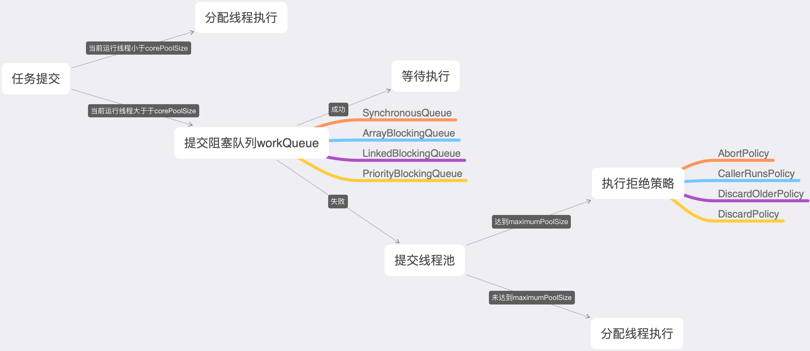

#一.进程是怎么在操作系统中运行的？
##1.同步机制应遵循的规则：
###1.1空闲让进
当无进程处于临界区时，表明临界资源处于空闲状态，应允许一个请求进入临界区的进程立即进入自己的临界区，
以有效的利用临界资源。
###1.2忙则等待
保证互斥访问临界资源。
###1.3有限等待
对要求访问临界资源的进程，应保证在有限时间内进入自己的临界区，以免陷入"死等"状态。
###1.4让权等待
当进程不能进入自己的临界区时，应立即释放处理机，以免进程陷入"忙等"。
#二.java线程池中各参数的作用。

##1.workQueue
SynchronousQueue：没有容量，直接提交线程池执行。

ArrayBlockingQueue：有界队列，如果该队列已满，则将出发拒绝策略。

LinkedBlockingQueue：一个由链表组成的有界队列，此队列的默认长度为Integer.MAX_VALUE。

LinkedTransferQueue：一个由链表组成的无界阻塞队列。

PriorityBlockingQueue：该队列可以根据任务自身的优先级顺序执行。
##2.拒绝策略policy
AbortPolicy：直接抛出异常，阻止系统正常工作。

CallerRunsPolicy：在调用者线程中运行当前被丢弃的任务。

DiscardOldestPolicy：丢弃最老的一个请求，也就是即将执行的一个任务，并尝试再次提交当前任务。

DiscardPolicy：该策略默默丢弃无法处理的任务，不予任何处理。

如以上策略仍然无法满足实际应用的需要，可以自己扩展RejectedExecutionHandler。

##3.设置线程池数量

Ncpu=CPU的数量
Ucpu=目标cpu的使用率，0<=Ucpu<=1
W/C=等待时间与计算时间的比率

Nthreads=Ncpu*Ucpu*(1+W/C)

一般情况下io密集型的设置为2*Ncpu，cpu密集型的设置为Ncpu。Ncpu的个数可以通过以下代码获得:
```
Runtime.getRuntime().availableProcessors();
```
**参考资料：**
a.《计算机操作系统》——汤子瀛 哲凤屏 汤小丹——Page 41
b.《实战Java高并发程序设计（第2版）》——葛一鸣——Page 110、112、113、119