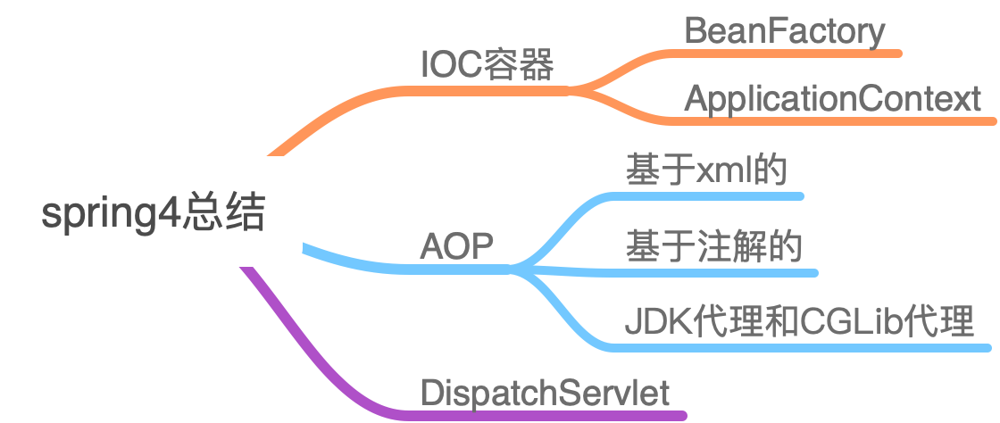
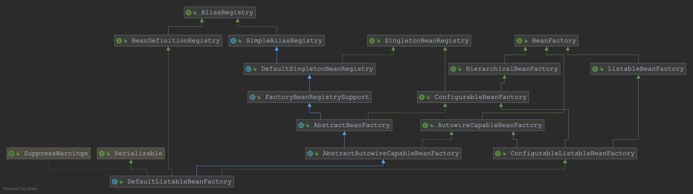

# Spring4总结
Spring一直贯彻并遵守"设计优于实现"，代码应该易于测试。这种思想表现在很多方面，比如说，Spring中
到处可见的interface，它使用接口来描述逻辑，以达到隔离代码，减少依赖性，解耦的目的。

Spring4主要包含以下几个问题：


AOP的八个要素：连接点(JoinPoint)、切点(pointCut)、增强(Advice)、目标对象(target)、引介(Introduction)、
织入(weaving)、代理(proxy)和切面(Aspect)

## 1 SpringBoot

Spring Boot革新Spring项目开发体验之道，其实是借助强大的Groovy动态语言实现的。在其核心变易模块中，
Spring Boot使用Groovy来构建工程文件，所以它可以轻松利用导入摸板及方法模板对类所生成的字节码进行改造。

### 1.1 SpringBoot启动器
 
springboot由一系列启动器构成，这些启动器构成了一个强大灵活的开发助手。
在pom中添加如下配置，即可引入web相关的配置

```
<parent>
    <groupId>org.springframework.boot</groupId>
    <artifactId>spring-boot-starter-parent</artifactId>
    <version>1.5.7.RELEASE</version>
</parent>
    <dependency>
      <groupId>org.springframework.boot</groupId>
      <artifactId>spring-boot-starter-web</artifactId>
    </dependency>
```

启动器spring-boot-starter-web内部封装了spring-web、spring-webmvc、jackjson、tomcat等模块。

### 1.2 SpringBoot相关注解

@SpringBootApplication:该注解其实包含了三个注解@Configuration、@ComponentScan和@EnableAutoConfiguration.
@Configuration、@Import、@ImportResource、@Bean是JavaConfig项目提供的用于代替xml配置bean的注解。可以参考如下链接。

- [java5.0注解知识](./src/main/java/com/smart/aspectj/anno/readme.md)

- [javaConfig项目注解](./src/main/java/com/smart/conf/readme.md)

## 2 IoC容器

容器是指管理java类的工具。以什么方式管理呢？控制反转(Inverse of Control)或者说依赖注入(Dependency Injection)。

### 2.1 BeanFactory

BeanFactory是spring底层的容器，相当于spring自身的容器。一般，开发者不会使用该类。BeanFactory提供了多种实现，最常用
的是XmlBeanDefinitionReader和DefaultListableBeanFactory(类图如下所示)。



BeanFactory的类继承结构设计优雅，通过类继承体系可以很容易的了解它具有哪些功能。
比如，ConfigurableBeanFactory是一个重要的接口，该接口提供了设置类装载器，属性编辑器，容器初始化后置处理器等的方法。从而增加了IoC容器的
可定制性。HierarchicalBeanFactory是父子级联IoC容器，子容器可以通过该接口方法访问父容器。AutowireCapableBeanFactory定义了容器中的Bean
按某种规则进行自动装配。

### 2.2 ApplicationContext