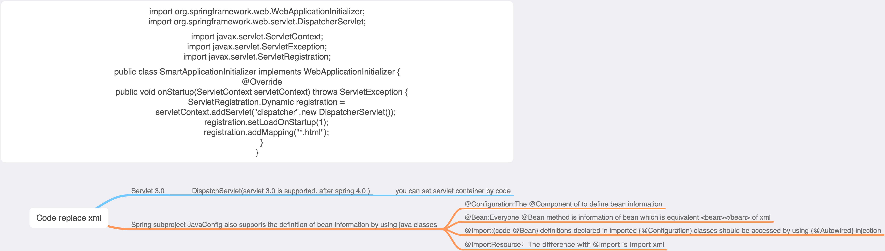

在已经导入的@Configuration注解类里用@Bean注解定义声明过得，可以使用@Autowired注解注入之后访问。

```
public class UserDao {
    public String printName(String name){
        return "My name is "+name;
    }
}

public class LogDao {
    public void printHello() {
        System.out.println("LogDao say Hello world!");
    }
}

public class LogonService {
    private LogDao logDao;
    private UserDao userDao;

    public void setLogDao(LogDao logDao) {
        this.logDao = logDao;
    }

    public void setUserDao(UserDao userDao) {
        this.userDao = userDao;
    }

    public void printHello() {
        System.out.println("LogonService say Hello world!");
        logDao.printHello();
    }
}

@Configuration
public class DaoConfig {
    @Bean
    public UserDao userDao(){
        return new UserDao();
    }
    @Bean
    public LogDao logDao(){
        return new LogDao();
    }
}


@Configuration
@Import(DaoConfig.class)
public class ServiceConfigC {

    @Autowired
    private LogDao logDao;
    @Bean
    public LogonService logonService(){
        LogonService logonService = new LogonService();
        logonService.setLogDao(logDao);
        return logonService;
    }
}

public class JavaConfigTest {
    @Test
    public void main(){
        AnnotationConfigApplicationContext ctx = new AnnotationConfigApplicationContext();
        ctx.register(ServiceConfigC.class);
        ctx.refresh();
        LogonService logonService = ctx.getBean(LogonService.class);
        logonService.printHello();
        UserDao userDao = ctx.getBean(UserDao.class);
        System.out.println(userDao.printName("Trump"));
        DaoConfig daoConfig = ctx.getBean(DaoConfig.class);
        System.out.println(daoConfig.userDao().printName("Tom"));
    }
}
/* Output
LogonService say Hello world!
LogDao say Hello world!
My name is Trump
My name is Tom
*/

```

Is difference between @Import and @Autowired?

@Import连接了两个配置类；@Autowired用于注入bean。
如果，从初始化到注入并使用是一个流程的话，@Import、@Configuration、@Bean是这个流程的前半部分，
而@Autowired是这个流程的后半部分。这就像南水北调中线工程一样，经过丹江口水库，最终北京人喝上了汉江、长江，甚至是金沙江、雅砻江、大渡河、岷江的水。
来仔细看看发生了什么？金沙江（@Configuration）、雅砻江（@Configuration）、
大渡河（@Configuration）、岷江（@Configuration）、长江（@Configuration）汇聚了
 很多地表水（@Bean）、地下水（@Bean）、雨水（@Bean）等，汇入（@Import）了丹江口水库（ApplicationContext）；经过丹江口水库的各种处理，将水资源
 调向北京，并通过各种开关（@Autowired）流入了千家万户。
 所以，长江（ServiceConfigC）的水（LogonService）可以是来自金沙江（DaoConfig）的地表水（LogDao）。北京人（JavaConfigTest）可以喝到来自
 长江（ServiceConfigC）的水（LogonService），也可以喝到来自金沙江（DaoConfig）的地下水（UserDao）。你也可以说，北京人（JavaConfigTest）
 喝的是来自丹江口（ApplicationContext）的地下水（UserDao），也可以说，北京人喝的是来自金沙江的（DaoConfig）的地下水（UserDao）。