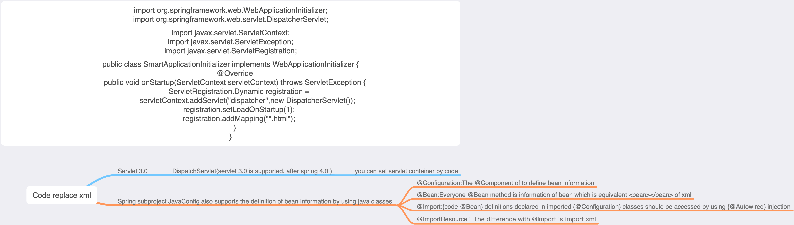

```
public class SmartApplicationInitializer implements WebApplicationInitializer {
    @Override
    public void onStartup(ServletContext servletContext) throws ServletException {
        ServletRegistration.Dynamic registration =
                servletContext.addServlet("dispatcher",new DispatcherServlet());
        registration.setLoadOnStartup(1);
        registration.addMapping("*.html");
    }
}
```

接下来看看Servlet3.0的实现原理。在Servlet3.0环境中，容器会在路劲中查找实现javax.servlet.ServletContainerInitializer的类，
如果发现已有实现类，就会调用它来配置Servlet容器。在Spring中，org.springframework.web.SpringServlerContainerInitializer
类实现了该接口，同时这个类又会查找实现org.springframework.web.WebApplicationInitializer接口的类，并将配置任务交给这些实现类去完成。
另外，Spring提供了一个便利的抽象类AbstractAnnotationConfigDispatchServletInitializer来实现这个接口，使得它在注册DispatchServlet
时只需简单指定Servlet的映射即可。在上面的示例中，当应用部署到Servlet3.0容器中时，容器启动时会自动发现它，并使用它来配置Servlet上下文。